## Two's complement

Two's complement is not a complicated scheme and is not well served by anything lengthly. Therefore, after this introduction, which explains what two's complement is and how to use it, there are mostly examples.

Two's complement is the way every computer I know of chooses to represent integers. To get the two's complement negative notation of an integer, you write out the number in binary. You then invert the digits, and add one to the result.

Suppose we're working with 8 bit quantities (for simplicity's sake) and suppose we want to find how -28 would be expressed in two's complement notation. First we write out 28 in binary form.

    0 0 0 1 1 1 0 0

Then we invert the digits. 0 becomes 1, 1 becomes 0.

    1 1 1 0 0 0 1 1

Then we add 1.

    1 1 1 0 0 1 0 0

That is how one would write -28 in 8 bit binary.

## Conversion from Two's Complement

Use the number 0xFFFFFFFF as an example. In binary, that is:

    1111 1111 1111 1111 1111 1111 1111 1111

What can we say about this number? It's first (leftmost) bit is 1, which means that this represents a number that is negative. That's just the way that things are in two's complement: a leading 1 means the number is negative, a leading 0 means the number is 0 or positive.

To see what this number is a negative of, we reverse the sign of this number. But how to do that? The class notes say (on 3.17) that to reverse the sign you simply invert the bits (0 goes to 1, and 1 to 0) and add one to the resulting number.

The inversion of that binary number is, obviously:

    0000 0000 0000 0000 0000 0000 0000 0000


Then we add one.

    0000 0000 0000 0000 0000 0000 0000 0001

So the negative of 0xFFFFFFFF is 0x00000001, more commonly known as 1. So 0xFFFFFFFF is -1.

## Conversion to Two's Complement

Note that this works both ways. If you have -30, and want to represent it in 2's complement, you take the binary representation of 30:

    0000 0000 0000 0000 0000 0000 0001 1110

Invert the digits.

    1111 1111 1111 1111 1111 1111 1110 0001

And add one.

    1111 1111 1111 1111 1111 1111 1110 0010

Converted back into hex, this is 0xFFFFFFE2. And indeed, suppose you have this code:

```cpp
    include <studio.h>

    int main() {
      int myInt;
      myInt = 0xFFFFFFE2;
      printf("%d\n", myInt);
      return 0;
    }
```

## Arithmetic with Two's Complement

One of the nice properties of two's complement is that addition and subtraction is made very simple. With a system like two's complement, the circuitry for addition and subtraction can be unified, whereas otherwise they would have to be treated as separate operations.

In the examples in this section, I do addition and subtraction in two's complement, but you'll notice that every time I do actual operations with binary numbers I am always adding.

### Example 1

Suppose we want to add two numbers 69 and 12 together. If we're to use decimal, we see the sum is 81. But let's use binary instead, since that's what the computer uses.

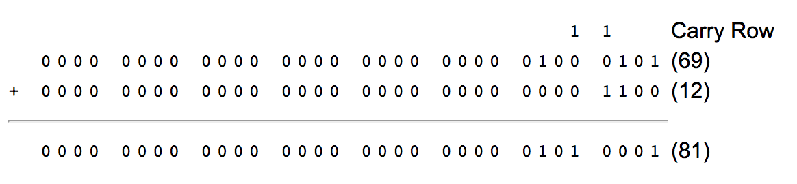

### Example 2

Now suppose we want to subtract 12 from 69. Now, 69 - 12 = 69 + (-12). To get the negative of 12 we take its binary representation, invert, and add one.

    0000 0000 0000 0000 0000 0000 0000 1100

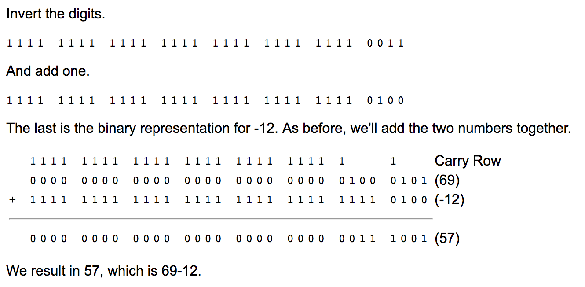

### Example 3

Lastly, we'll subtract 69 from 12. Similar to our operation in example 2, 12 - 69 = 12 + (- 69). The two's complement representation of 69 is the following. I assume you've had enough illustrations of inverting and adding one.

    1111 1111 1111 1111 1111 1111 1011 1011

So we add this number to 12.

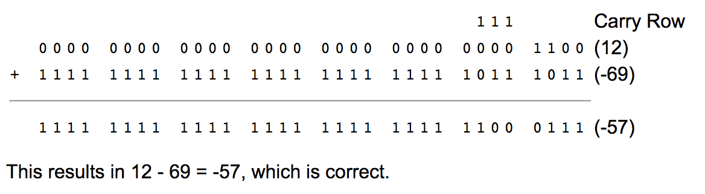

# Number Systems

## Binary (Base 2) Number System

Binary number system has two symbols: 0 and 1, called bits. It is also a positional notation, for example,

    10110B = 1×2^4 + 0×2^3 + 1×2^2 + 1×2^1 + 0×2^0

We shall denote a binary number with a suffix B. Some programming languages denote binary numbers with prefix 0b (e.g., 0b1001000), or prefix b with the bits quoted (e.g., b'10001111').

A binary digit is called a bit. Eight bits is called a byte (why 8-bit unit? Probably because 8=2^3).

## Hexadecimal (Base 16) Number System

Hexadecimal number system uses 16 symbols: 0, 1, 2, 3, 4, 5, 6, 7, 8, 9, A, B, C, D, E, and F, called hex digits. It is a positional notation, for example,

    A3EH = 10×16^2 + 3×16^1 + 14×16^0

We shall denote a hexadecimal number (in short, hex) with a suffix H. Some programming languages denote hex numbers with prefix 0x (e.g., 0x1A3C5F), or prefix x with hex digit quoted (e.g., x'C3A4D98B').

Each hexadecimal digit is also called a hex digit. Most programming languages accept lowercase 'a' to 'f' as well as uppercase 'A' to 'F'.

Computers uses binary system in their internal operations, as they are built from binary digital electronic components. However, writing or reading a long sequence of binary bits is cumbersome and error-prone. Hexadecimal system is used as a compact form or shorthand for binary bits. Each hex digit is equivalent to 4 binary bits, i.e., shorthand for 4 bits, as follows:

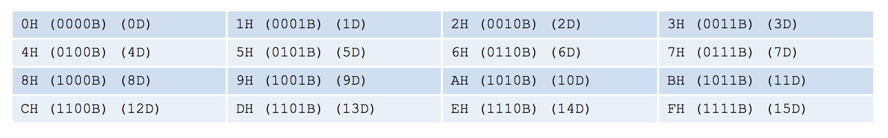

## Conversion from Hexadecimal to Binary

Starting from the right-most bit (least-significant bit), replace each group of 4 bits by the equivalent hex digit (pad the left-most bits with zero if necessary), for examples,

    1001001010B = 0010 0100 1010B = 24AH
    10001011001011B = 0010 0010 1100 1011B = 22CBH

It is important to note that hexadecimal number provides a compact form or shorthand for representing binary bits.

## Conversion from Base r to Decimal (Base 10)

Given a n-digit base r number: dn-1 dn-2 dn-3 ... d3 d2 d1 d0 (base r), the decimal equivalent is given by:

dn-1 × r^(n-1) + dn-2 × r^(n-2) + ... + d1 × r^1 + d0 × r^0
For examples,

    A1C2H = 10×16^3 + 1×16^2 + 12×16^1 + 2 = 41410 (base 10)
    10110B = 1×2^4 + 1×2^2 + 1×2^1 = 22 (base 10)

## Conversion from Decimal (Base 10) to Base r

Use repeated division/remainder. For example,

To convert 261D to hexadecimal:

    261/16 => quotient=16 remainder=5
    16/16  => quotient=1  remainder=0
    1/16   => quotient=0  remainder=1 (quotient=0 stop)
    Hence, 261D = 105H

The above procedure is actually applicable to conversion between any 2 base systems. For example,

To convert 1023(base 4) to base 3:

    1023(base 4)/3 => quotient=25D remainder=0
    25D/3          => quotient=8D  remainder=1
    8D/3           => quotient=2D  remainder=2
    2D/3           => quotient=0   remainder=2 (quotient=0 stop)
    Hence, 1023(base 4) = 2210(base 3)

## General Conversion between 2 Base Systems with Fractional Part

> * Separate the integral and the fractional parts.
> * For the integral part, divide by the target radix repeatably, and collect the ramainder in reverse order.
> * For the fractional part, multiply the fractional part by the target radix repeatably, and collect the integral part in the same order.

Example 1 :

    Convert 18.6875D to binary
    Integral Part = 18D

    18/2 => quotient=9 remainder=0
    9/2  => quotient=4 remainder=1
    4/2  => quotient=2 remainder=0
    2/2  => quotient=1 remainder=0
    1/2  => quotient=0 remainder=1 (quotient=0 stop)
    Hence, 18D = 10010B

    Fractional Part = .6875D
    .6875*2=1.375 => whole number is 1
    .375*2=0.75   => whole number is 0
    .75*2=1.5     => whole number is 1
    .5*2=1.0      => whole number is 1
    Hence .6875D = .1011B

Therefore, 18.6875D = 10010.1011B

Example 2:

    Convert 18.6875D to hexadecimal
    Integral Part = 18D
    18/16 => quotient=1 remainder=2
    1/16  => quotient=0 remainder=1 (quotient=0 stop)
    Hence, 18D = 12H

    Fractional Part = .6875D
    .6875*16=11.0 => whole number is 11D (BH)
    Hence .6875D = .BH

Therefore, 18.6875D = 12.BH

# Computer Memory & Data Representation

Computer uses a fixed number of bits to represent a piece of data, which could be a number, a character, or others. A n-bit storage location can represent up to 2^n distinct entities. For example, a 3-bit memory location can hold one of these eight binary patterns: 000, 001, 010, 011, 100, 101, 110, or 111. Hence, it can represent at most 8 distinct entities. You could use them to represent numbers 0 to 7, numbers 8881 to 8888, characters 'A' to 'H', or up to 8 kinds of fruits like apple, orange, banana; or up to 8 kinds of animals like lion, tiger, etc.

Integers, for example, can be represented in 8-bit, 16-bit, 32-bit or 64-bit. You, as the programmer, choose an appropriate bit-length for your integers. Your choice will impose constraint on the range of integers that can be represented. Besides the bit-length, an integer can be represented in various representation schemes, e.g., unsigned vs. signed integers. An 8-bit unsigned integer has a range of 0 to 255, while an 8-bit signed integer has a range of -128 to 127 - both representing 256 distinct numbers.

It is important to note that a computer memory location merely stores a binary pattern. It is entirely up to you, as the programmer, to decide on how these patterns are to be interpreted. For example, the 8-bit binary pattern "0100 0001B" can be interpreted as an unsigned integer 65, or an ASCII character 'A', or some secret information known only to you. In other words, you have to first decide how to represent a piece of data in a binary pattern before the binary patterns make sense. The interpretation of binary pattern is called data representation or encoding. Furthermore, it is important that the data representation schemes are agreed-upon by all the parties, i.e., industrial standards need to be formulated and straightly followed.

Once you decided on the data representation scheme, certain constraints, in particular, the precision and range will be imposed. Hence, it is important to understand data representation to write correct and high-performance programs.

# Integer Representation

Integers are whole numbers or fixed-point numbers with the radix point fixed after the least-significant bit. They are contrast to real numbers or floating-point numbers, where the position of the radix point varies. It is important to take note that integers and floating-point numbers are treated differently in computers. They have different representation and are processed differently (e.g., floating-point numbers are processed in a so-called floating-point processor). Floating-point numbers will be discussed later.

Computers use a fixed number of bits to represent an integer. The commonly-used bit-lengths for integers are 8-bit, 16-bit, 32-bit or 64-bit. Besides bit-lengths, there are two representation schemes for integers:

> * Unsigned Integers: can represent zero and positive integers.
> * Signed Integers: can represent zero, positive and negative integers.

Three representation schemes had been proposed for signed integers:

> * Sign-Magnitude representation
> * 1's Complement representation
> * 2's Complement representation

You, as the programmer, need to decide on the bit-length and representation scheme for your integers, depending on your application's requirements. Suppose that you need a counter for counting a small quantity from 0 up to 200, you might choose the 8-bit unsigned integer scheme as there is no negative numbers involved.

## n-bit Unsigned Integers

Unsigned integers can represent zero and positive integers, but not negative integers. The value of an unsigned integer is interpreted as "the magnitude of its underlying binary pattern".

Example 1: Suppose that n=8 and the binary pattern is 0100 0001B, the value of this unsigned integer is 1×2^0 + 1×2^6 = 65D.

Example 2: Suppose that n=16 and the binary pattern is 0001 0000 0000 1000B, the value of this unsigned integer is 1×2^3 + 1×2^12 = 4104D.

Example 3: Suppose that n=16 and the binary pattern is 0000 0000 0000 0000B, the value of this unsigned integer is 0.

An n-bit pattern can represent 2^n distinct integers. An n-bit unsigned integer can represent integers from 0 to (2^n)-1, as tabulated below:

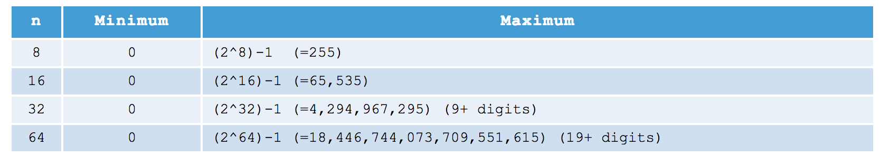

## Signed Integers

Signed integers can represent zero, positive integers, as well as negative integers. Three representation schemes are available for signed integers:

> * Sign-Magnitude representation
> * 1's Complement representation
> * 2's Complement representation

In all the above three schemes, the most-significant bit (msb) is called the sign bit. The sign bit is used to represent the sign of the integer - with 0 for positive integers and 1 for negative integers. The magnitude of the integer, however, is interpreted differently in different schemes.

## n-bit Sign Integers in Sign-Magnitude Representation

In sign-magnitude representation:

> * The most-significant bit (msb) is the sign bit, with value of 0 representing positive integer and 1 representing negative integer.
> * The remaining n-1 bits represents the magnitude (absolute value) of the integer. The absolute value of the integer is interpreted as "the magnitude of the (n-1)-bit binary pattern".

Example 1: Suppose that n=8 and the binary representation is 0 100 0001B.

    Sign bit is 0 ⇒ positive
    Absolute value is 100 0001B = 65D
    Hence, the integer is +65D

Example 2: Suppose that n=8 and the binary representation is 1 000 0001B.

    Sign bit is 1 ⇒ negative
    Absolute value is 000 0001B = 1D
    Hence, the integer is -1D

Example 3: Suppose that n=8 and the binary representation is 0 000 0000B.

    Sign bit is 0 ⇒ positive
    Absolute value is 000 0000B = 0D
    Hence, the integer is +0D

Example 4: Suppose that n=8 and the binary representation is 1 000 0000B.

    Sign bit is 1 ⇒ negative
    Absolute value is 000 0000B = 0D
    Hence, the integer is -0D

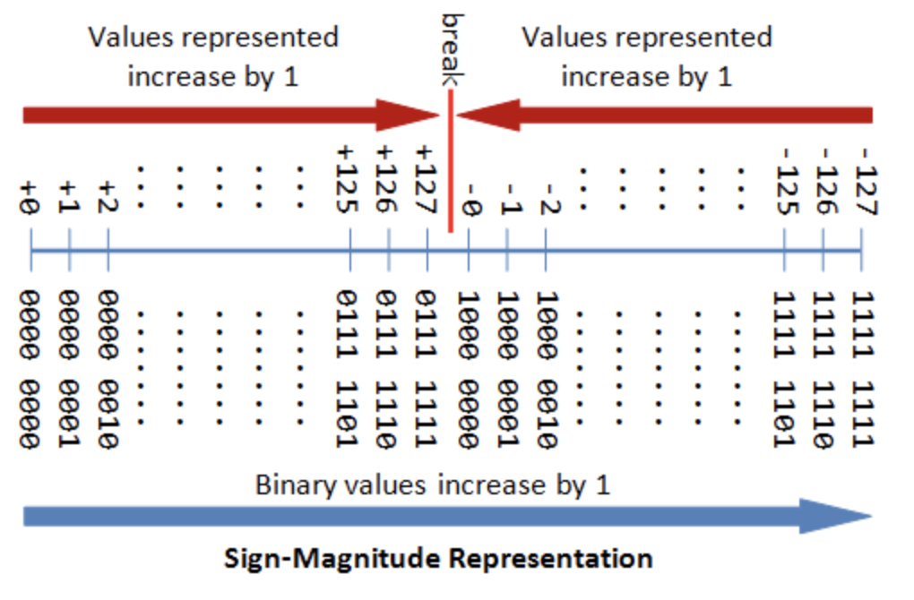

The drawbacks of sign-magnitude representation are:

> * There are two representations (0000 0000B and 1000 0000B) for the number zero, which could lead to inefficiency and confusion.
> * Positive and negative integers need to be processed separately.

## n-bit Sign Integers in 1's Complement Representation

In 1's complement representation:

> * Again, the most significant bit (msb) is the sign bit, with value of 0 representing positive integers and 1 representing negative integers.
> * The remaining n-1 bits represents the magnitude of the integer, as follows:
> * for positive integers, the absolute value of the integer is equal to "the magnitude of the (n-1)-bit binary pattern".
> * for negative integers, the absolute value of the integer is equal to "the magnitude of the complement (inverse) of the (n-1)-bit binary pattern" (hence called 1's complement).

Example 1: Suppose that n=8 and the binary representation 0 100 0001B.

    Sign bit is 0 ⇒ positive
    Absolute value is 100 0001B = 65D
    Hence, the integer is +65D

Example 2: Suppose that n=8 and the binary representation 1 000 0001B.

    Sign bit is 1 ⇒ negative
    Absolute value is the complement of 000 0001B, i.e., 111 1110B = 126D
    Hence, the integer is -126D

Example 3: Suppose that n=8 and the binary representation 0 000 0000B.

    Sign bit is 0 ⇒ positive
    Absolute value is 000 0000B = 0D
    Hence, the integer is +0D

Example 4: Suppose that n=8 and the binary representation 1 111 1111B.

    Sign bit is 1 ⇒ negative
    Absolute value is the complement of 111 1111B, i.e., 000 0000B = 0D
    Hence, the integer is -0D

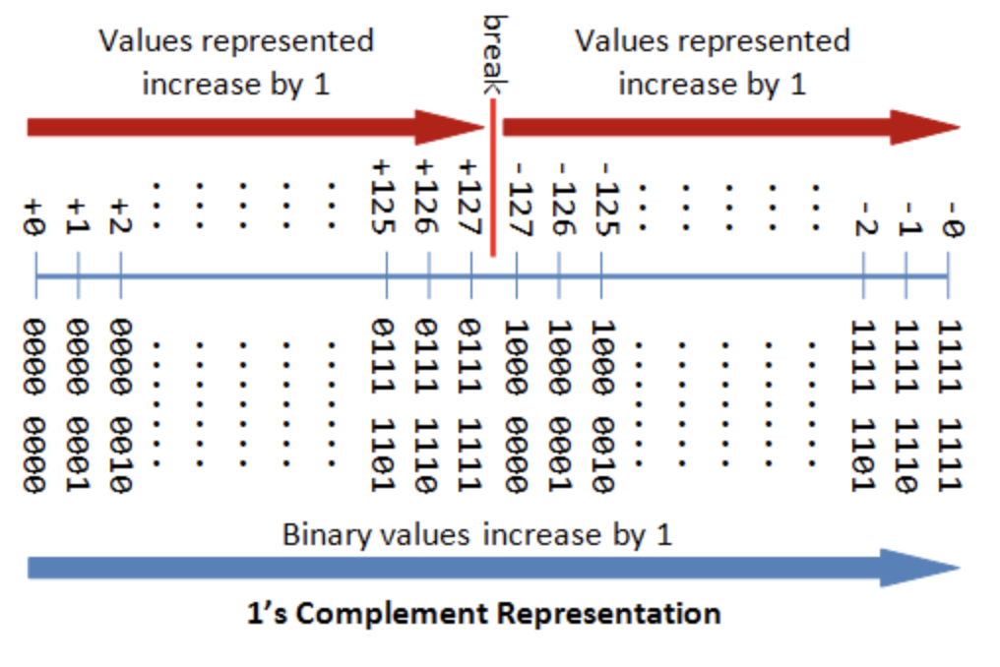

Again, the drawbacks are:

> * There are two representations (0000 0000B and 1111 1111B) for zero.
> * The positive integers and negative integers need to be processed separately.

## n-bit Sign Integers in 2's Complement Representation

In 2's complement representation:

> * Again, the most significant bit (msb) is the sign bit, with value of 0 representing positive integers and 1 representing negative integers.
> * The remaining n-1 bits represents the magnitude of the integer, as follows:
> * for positive integers, the absolute value of the integer is equal to "the magnitude of the (n-1)-bit binary pattern".
> * for negative integers, the absolute value of the integer is equal to "the magnitude of the complement of the (n-1)-bit binary pattern plus one" (hence called 2's complement).

Example 1: Suppose that n=8 and the binary representation 0 100 0001B.

    Sign bit is 0 ⇒ positive
    Absolute value is 100 0001B = 65D
    Hence, the integer is +65D

Example 2: Suppose that n=8 and the binary representation 1 000 0001B.

    Sign bit is 1 ⇒ negative
    Absolute value is the complement of 000 0001B plus 1, i.e., 111 1110B + 1B = 127D
    Hence, the integer is -127D

Example 3: Suppose that n=8 and the binary representation 0 000 0000B.

    Sign bit is 0 ⇒ positive
    Absolute value is 000 0000B = 0D
    Hence, the integer is +0D

Example 4: Suppose that n=8 and the binary representation 1 111 1111B.

    Sign bit is 1 ⇒ negative
    Absolute value is the complement of 111 1111B plus 1, i.e., 000 0000B + 1B = 1D
    Hence, the integer is -1D

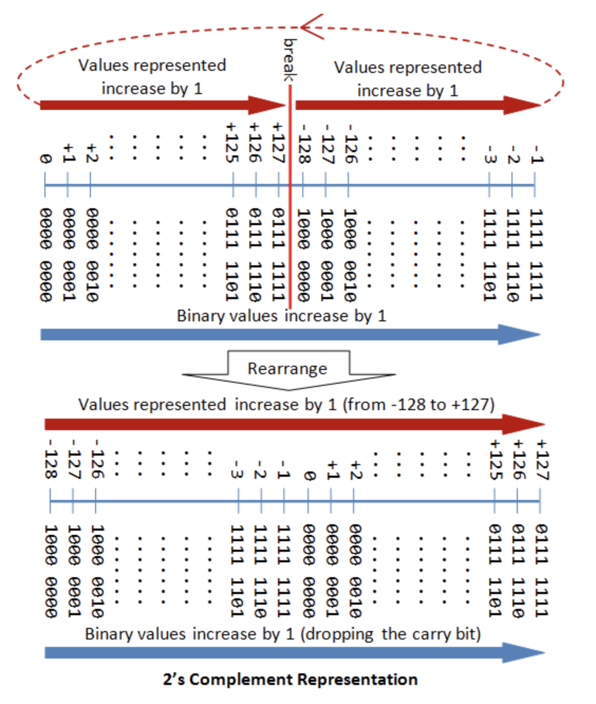

## Computers use 2's Complement Representation for Signed Integers

We have discussed three representations for signed integers: signed-magnitude, 1's complement and 2's complement. Computers use 2's complement in representing signed integers. This is because:

> * There is only one representation for the number zero in 2's complement, instead of two representations in sign-magnitude and 1's complement.
> * Positive and negative integers can be treated together in addition and subtraction. Subtraction can be carried out using the "addition logic".

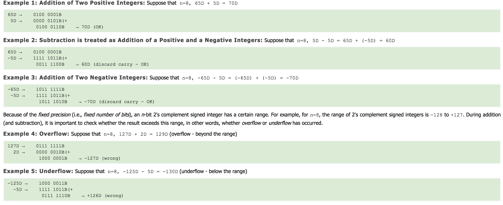

The following diagram explains how the 2's complement works. By re-arranging the number line, values from -128 to +127 are represented contiguously by ignoring the carry bit.


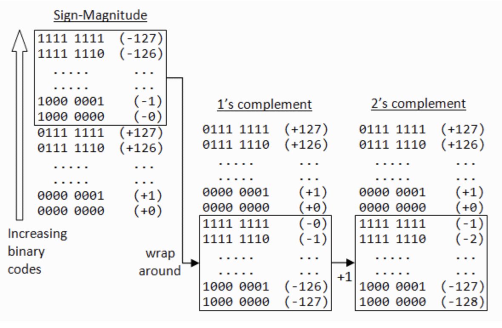

## Range of n-bit 2's Complement Signed Integers

An n-bit 2's complement signed integer can represent integers from -2^(n-1) to +2^(n-1)-1, as tabulated. Take note that the scheme can represent all the integers within the range, without any gap. In other words, there is no missing integers within the supported range.

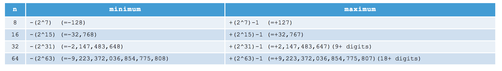

## Decoding 2's Complement Numbers

> * Check the sign bit (denoted as S).
> * If S=0, the number is positive and its absolute value is the binary value of the remaining n-1 bits.
> * If S=1, the number is negative. you could "invert the n-1 bits and plus 1" to get the absolute value of negative number.

Alternatively, you could scan the remaining n-1 bits from the right (least-significant bit). Look for the first occurrence of 1. Flip all the bits to the left of that first occurrence of 1. The flipped pattern gives the absolute value. For example,

    n = 8, bit pattern = 1 100 0100B
    S = 1 → negative
    Scanning from the right and flip all the bits to the left of the first occurrence of 1 ⇒ 011 1100B = 60D
    Hence, the value is -60D

## Big Endian vs. Little Endian

Modern computers store one byte of data in each memory address or location, i.e., byte addressable memory. An 32-bit integer is, therefore, stored in 4 memory addresses.

The term"Endian" refers to the order of storing bytes in computer memory. In "Big Endian" scheme, the most significant byte is stored first in the lowest memory address (or big in first), while "Little Endian" stores the least significant bytes in the lowest memory address.

For example, the 32-bit integer 12345678H (30541989610) is stored as 12H 34H 56H 78H in big endian; and 78H 56H 34H 12H in little endian. An 16-bit integer 00H 01H is interpreted as 0001H in big endian, and 0100H as little endian.

# Floating-Point Number Representation

A floating-point number (or real number) can represent a very large (1.23×10^88) or a very small (1.23×10^-88) value. It could also represent very large negative number (-1.23×10^88) and very small negative number (-1.23×10^88), as well as zero, as illustrated:

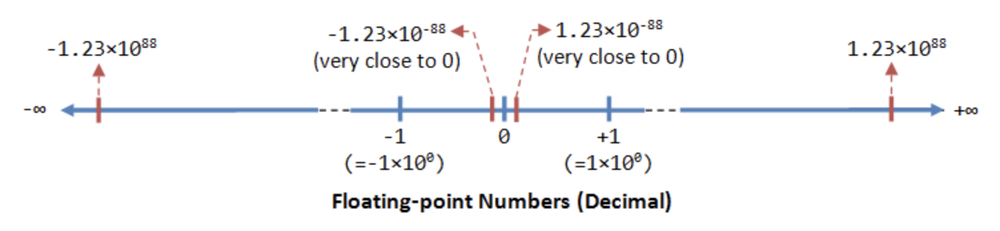

A floating-point number is typically expressed in the scientific notation, with a fraction (F), and an exponent (E) of a certain radix (r), in the form of F×r^E. Decimal numbers use radix of 10 (F×10^E); while binary numbers use radix of 2 (F×2^E).

Representation of floating point number is not unique. For example, the number 55.66 can be represented as 5.566×10^1, 0.5566×10^2, 0.05566×10^3, and so on. The fractional part can be normalized. In the normalized form, there is only a single non-zero digit before the radix point. For example, decimal number 123.4567 can be normalized as 1.234567×10^2; binary number 1010.1011B can be normalized as 1.0101011B×2^3.

It is important to note that floating-point numbers suffer from loss of precision when represented with a fixed number of bits (e.g., 32-bit or 64-bit). This is because there are infinite number of real numbers (even within a small range of says 0.0 to 0.1). On the other hand, a n-bit binary pattern can represent a finite 2^n distinct numbers. Hence, not all the real numbers can be represented. The nearest approximation will be used instead, resulted in loss of accuracy.

It is also important to note that floating number arithmetic is very much less efficient than integer arithmetic. It could be speed up with a so-called dedicated floating-point co-processor. Hence, use integers if your application does not require floating-point numbers.

In computers, floating-point numbers are represented in scientific notation of fraction (F) and exponent (E) with a radix of 2, in the form of F×2^E. Both E and F can be positive as well as negative. Modern computers adopt IEEE 754 standard for representing floating-point numbers. There are two representation schemes: 32-bit single-precision and 64-bit double-precision.

## IEEE-754 32-bit Single-Precision Floating-Point Numbers

In 32-bit single-precision floating-point representation:

> * The most significant bit is the sign bit (S), with 0 for positive numbers and 1 for negative numbers.
> * The following 8 bits represent exponent (E).
> * The remaining 23 bits represents fraction (F).

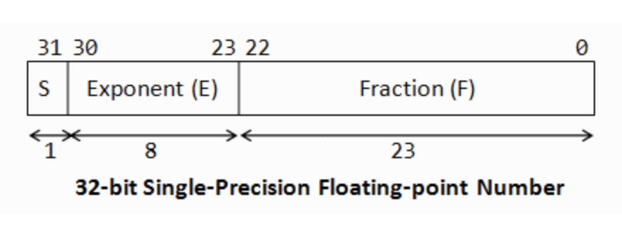

### Normalized Form

Let's illustrate with an example, suppose that the 32-bit pattern is **1 1000 0001 011 0000 0000 0000 0000 0000**, with:

    S = 1
    E = 1000 0001
    F = 011 0000 0000 0000 0000 0000

In the normalized form, the actual fraction is normalized with an implicit leading 1 in the form of 1.F. In this example, the actual fraction is 1.011 0000 0000 0000 0000 0000 = 1 + 1×2^-2 + 1×2^-3 = 1.375D.

The sign bit represents the sign of the number, with S=0 for positive and S=1 for negative number. In this example with S=1, this is a negative number, i.e., -1.375D.

In normalized form, the actual exponent is E-127 (so-called excess-127 or bias-127). This is because we need to represent both positive and negative exponent. With an 8-bit E, ranging from 0 to 255, the excess-127 scheme could provide actual exponent of -127 to 128. In this example, E-127=129-127=2D.

Hence, the number represented is -1.375×2^2=-5.5D.

### De-Normalized Form

Normalized form has a serious problem, with an implicit leading 1 for the fraction, it cannot represent the number zero!

De-normalized form was devised to represent zero and other numbers.

For E=0, the numbers are in the de-normalized form. An implicit leading 0 (instead of 1) is used for the fraction; and the actual exponent is always -126. Hence, the number zero can be represented with E=0 and F=0 (because 0.0×2^-126=0).

We can also represent very small positive and negative numbers in de-normalized form with E=0. For example, if S=1, E=0, and F=011 0000 0000 0000 0000 0000. The actual fraction is 0.011=1×2^-2+1×2^-3=0.375D. Since S=1, it is a negative number. With E=0, the actual exponent is -126. Hence the number is -0.375×2^-126 = -4.4×10^-39, which is an extremely small negative number (close to zero).

### Summary
In summary, the value (N) is calculated as follows:

> * For 1 ≤ E ≤ 254, N = (-1)^S × 1.F × 2^(E-127). These numbers are in the so-called normalized form. The sign-bit represents the sign of the number. Fractional part (1.F) are normalized with an implicit leading 1. The exponent is bias (or in excess) of 127, so as to represent both positive and negative exponent. The range of exponent is -126 to +127.
> * For E = 0, N = (-1)^S × 0.F × 2^(-126). These numbers are in the so-called denormalized form. The exponent of 2^-126 evaluates to a very small number. Denormalized form is needed to represent zero (with F=0 and E=0). It can also represents very small positive and negative number close to zero.
> * For E = 255, it represents special values, such as ±INF (positive and negative infinity) and NaN (not a number). This is beyond the scope of this article.

Example 1: Suppose that IEEE-754 32-bit floating-point representation pattern is 0 10000000 110 0000 0000 0000 0000 0000.

    Sign bit S = 0 ⇒ positive number
    E = 1000 0000B = 128D (in normalized form)
    Fraction is 1.11B (with an implicit leading 1) = 1 + 1×2^-1 + 1×2^-2 = 1.75D
    The number is +1.75 × 2^(128-127) = +3.5D

Example 2: Suppose that IEEE-754 32-bit floating-point representation pattern is 1 01111110 100 0000 0000 0000 0000 0000.

    Sign bit S = 1 ⇒ negative number
    E = 0111 1110B = 126D (in normalized form)
    Fraction is 1.1B  (with an implicit leading 1) = 1 + 2^-1 = 1.5D
    The number is -1.5 × 2^(126-127) = -0.75D

Example 3: Suppose that IEEE-754 32-bit floating-point representation pattern is 1 01111110 000 0000 0000 0000 0000 0001.

    Sign bit S = 1 ⇒ negative number
    E = 0111 1110B = 126D (in normalized form)
    Fraction is 1.000 0000 0000 0000 0000 0001B  (with an implicit leading 1) = 1 + 2^-23
    The number is -(1 + 2^-23) × 2^(126-127) = -0.500000059604644775390625 (may not be exact in decimal!)

Example 4 (De-Normalized Form): Suppose that IEEE-754 32-bit floating-point representation pattern is 1 00000000 000 0000 0000 0000 0000 0001.

    Sign bit S = 1 ⇒ negative number
    E = 0 (in de-normalized form)
    Fraction is 0.000 0000 0000 0000 0000 0001B  (with an implicit leading 0) = 1×2^-23
    The number is -2^-23 × 2^(-126) = -2×(-149) ≈ -1.4×10^-45

## IEEE-754 64-bit Double-Precision Floating-Point Numbers

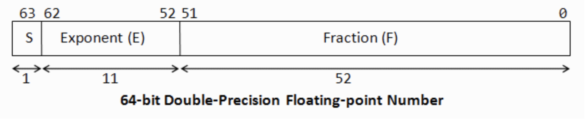

The representation scheme for 64-bit double-precision is similar to the 32-bit single-precision:

> * The most significant bit is the sign bit (S), with 0 for positive numbers and 1 for negative numbers.
> * The following 11 bits represent exponent (E).
> * The remaining 52 bits represents fraction (F).

The value (N) is calculated as follows:

> * Normalized form: For 1 ≤ E ≤ 2046, N = (-1)^S × 1.F × 2^(E-1023).
> * Denormalized form: For E = 0, N = (-1)^S × 0.F × 2^(-1022). These are in the denormalized form.
> * For E = 2047, N represents special values, such as ±INF (infinity), NaN (not a number).

## More on Floating-Point Representation

There are three parts in the floating-point representation:

> * The sign bit (S) is self-explanatory (0 for positive numbers and 1 for negative numbers).
> * For the exponent (E), a so-called bias (or excess) is applied so as to represent both positive and negative exponent. The bias is set at half of the range. For single precision with an 8-bit exponent, the bias is 127 (or excess-127). For double precision with a 11-bit exponent, the bias is 1023 (or excess-1023).
> * The fraction (F) (also called the mantissa or significand) is composed of an implicit leading bit (before the radix point) and the fractional bits (after the radix point). The leading bit for normalized numbers is 1; while the leading bit for denormalized numbers is 0.

# Character Encoding

In computer memory, character are "encoded" (or "represented") using a chosen "character encoding schemes" (aka "character set", "charset", "character map", or "code page").

For example, in ASCII (as well as Latin1, Unicode, and many other character sets):

code numbers 65D (41H) to 90D (5AH) represents 'A' to 'Z', respectively.
code numbers 97D (61H) to 122D (7AH) represents 'a' to 'z', respectively.
code numbers 48D (30H) to 57D (39H) represents '0' to '9', respectively.
It is important to note that the representation scheme must be known before a binary pattern can be interpreted. E.g., the 8-bit pattern "0100 0010B" could represent anything under the sun known only to the person encoded it.

The most commonly-used character encoding schemes are: 7-bit ASCII (ISO/IEC 646) and 8-bit Latin-x (ISO/IEC 8859-x) for western european characters, and Unicode (ISO/IEC 10646) for internationalization (i18n).

A 7-bit encoding scheme (such as ASCII) can represent 128 characters and symbols. An 8-bit character encoding scheme (such as Latin-x) can represent 256 characters and symbols; whereas a 16-bit encoding scheme (such as Unicode UCS-2) can represents 65,536 characters and symbols.
